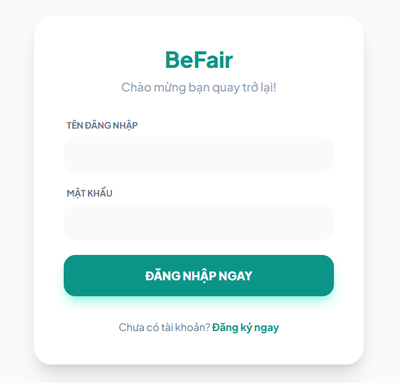
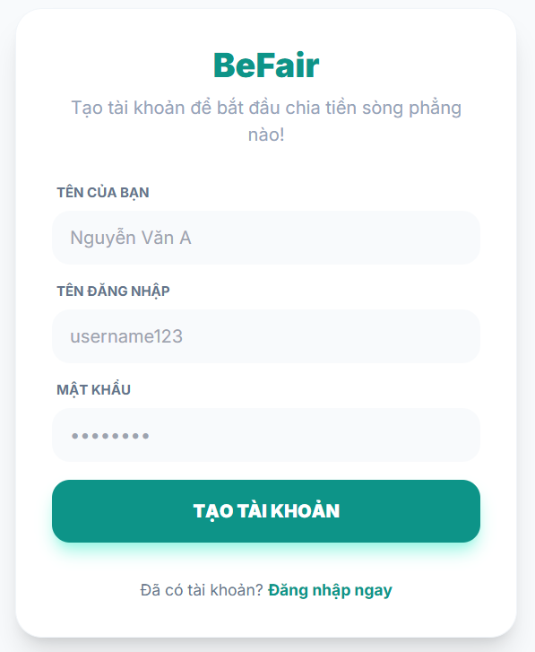
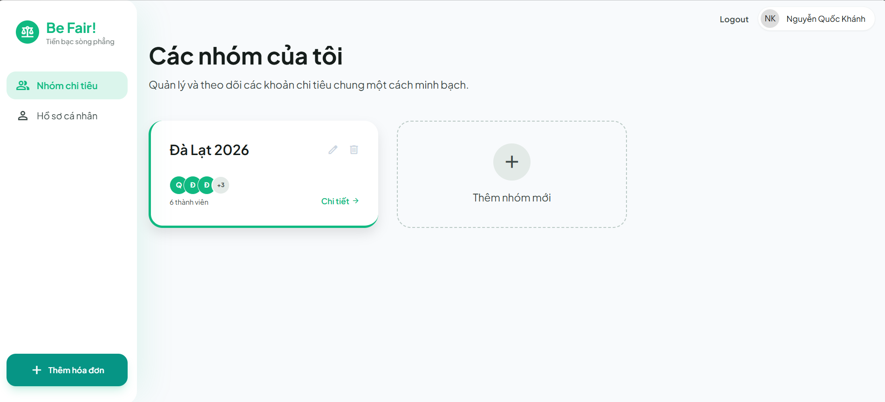
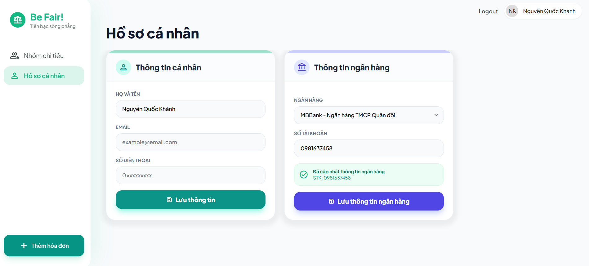
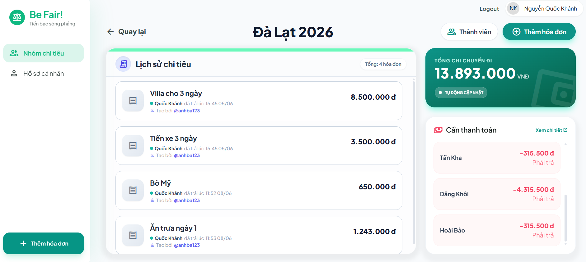
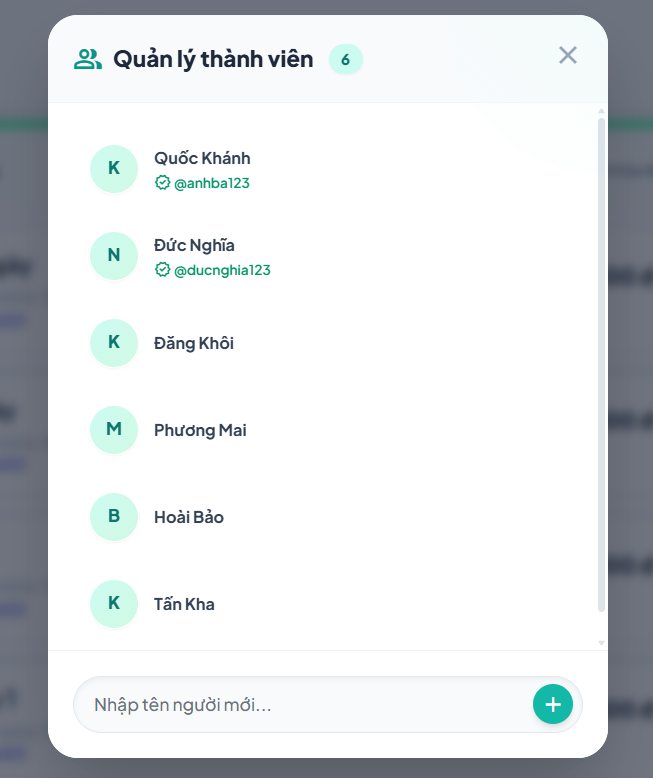
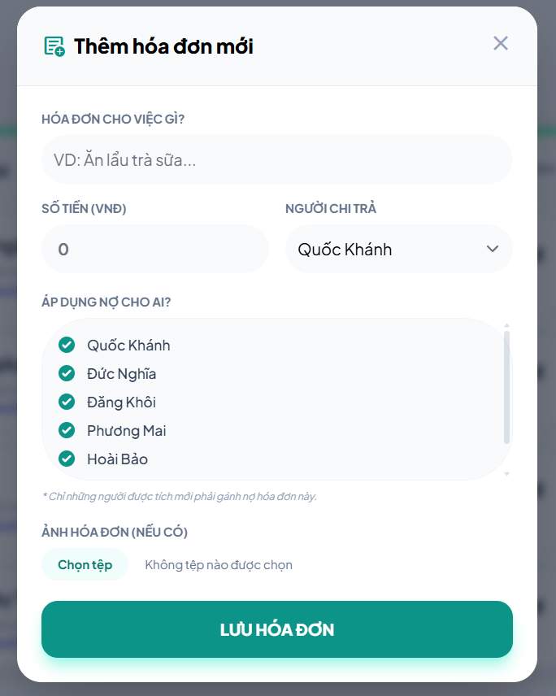
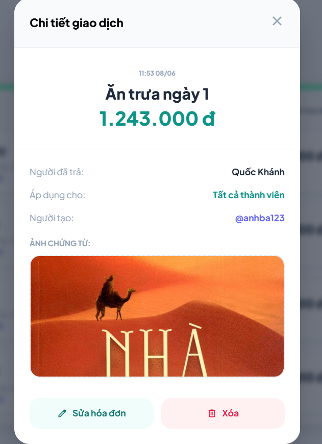
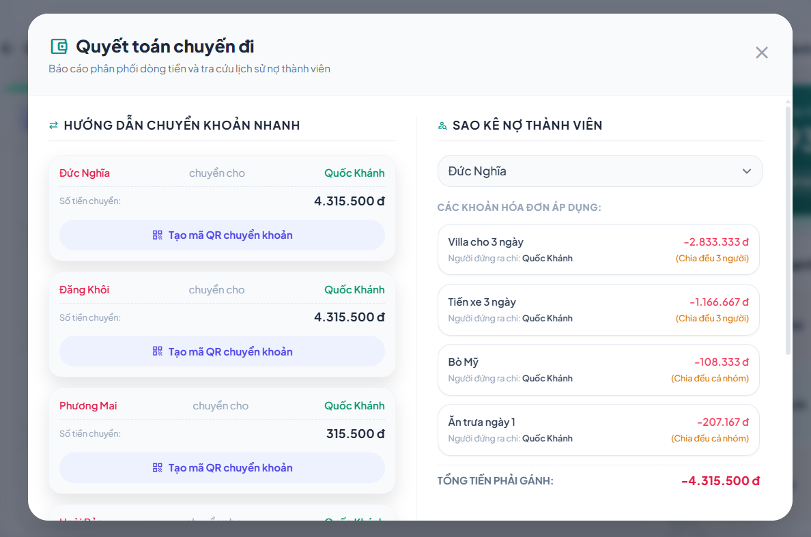

<div align="center">

# 💸 Be Fair!

### *Tiền bạc sòng phẳng — Cuộc vui trọn vẹn*

[](https://www.java.com)
[](https://spring.io/projects/spring-boot)
[](https://www.mysql.com)
[](https://www.thymeleaf.org)
[](https://tailwindcss.com)

**Be Fair!** là ứng dụng web giúp các nhóm bạn, gia đình, đồng nghiệp dễ dàng ghi chép và chia đều chi phí sau mỗi chuyến du lịch, liên hoan hay hoạt động tập thể — minh bạch, nhanh chóng, không còn ai nợ ai mà không biết.

</div>

---

## 📸 Giao diện ứng dụng
Giao diện đăng nhập - đăng ký

<table border="0">
  <tr>
    <td align="center">
      
      <br>
      <b>Giao diện đăng nhập</b>
    </td>
    <td align="center">
      
      <br>
      <b>Giao diện đăng ký</b>
    </td>
  </tr>
</table>

Giao diện màn hình chính



Form chức năng thêm hóa đơn nhanh

<p align="center">
  
</p>

Giao diện màn hình hồ sơ cá nhân



Giao diện màn hình chi tiết nhóm



<table border="0">
  <tr>
    <td align="center">
      
      <br>
      <b>Bảng hiển thị danh sách thành viên</b>
    </td>
    <td align="center">
      
      <br>
      <b>Form nhập hóa đơn</b>
    </td>
    <td align="center">
      
      <br>
      <b>Chi tiết hóa đơn</b>
    </td>
  </tr>
</table>

Giao diện bảng quyết toán

<table border="0">
  <tr>
    <td align="center">
        
      <br>
      <b>Bảng quyết toán</b>
    </td>
    <td align="center">
      
      <br>
      <b>Tạo QR</b>
    </td>
    </td>
  </tr>
</table>

## ✨ Tính năng nổi bật

### 🔐 Tài khoản & Bảo mật
- Đăng ký / Đăng nhập tích hợp **Spring Security**
- Mật khẩu được mã hóa bằng **BCryptPasswordEncoder**
- Hồ sơ cá nhân: cập nhật họ tên, email, SĐT, thông tin tài khoản ngân hàng

### 👥 Quản lý Nhóm Chi tiêu
- Tạo nhóm chi tiêu gắn liền với tài khoản sở hữu
- Đổi tên nhóm, xóa nhóm — tự động dọn dẹp toàn bộ dữ liệu liên quan
- **Phân quyền rõ ràng:** Chủ nhóm có đầy đủ quyền quản lý

### 🧑‍🤝‍🧑 Quản lý Thành viên
| Chức năng | Mô tả |
|-----------|-------|
| ➕ Thêm thành viên | Thêm nhanh vào nhóm theo tên |
| ✏️ Đổi tên | Sửa tên thành viên khi cần |
| 🔗 Liên kết tài khoản | Gắn thành viên với tài khoản người dùng thực |
| 🗑️ Xóa mềm | Ẩn thành viên, không xóa lịch sử tính toán |

### 🧾 Ghi chép Hóa đơn
- Ghi nhận **người chi trả** và **danh sách người chia** cho từng hóa đơn
- **Tải ảnh hóa đơn** trực tiếp lên hệ thống
- Tự động chia đều cho **toàn bộ thành viên đang hoạt động** nếu không chỉ định
- Thêm, sửa, xóa hóa đơn với kiểm soát quyền hạn chặt chẽ

### 🧮 Giải thuật Quyết toán Tự động
- Phân tích toàn bộ lịch sử hóa đơn → tính **số dư thực tế** từng người
- Tự động **ghép cặp người nợ ↔ người được nợ** để tối ưu số lần chuyển tiền
- Hiển thị chi tiết: **ai cần chuyển bao nhiêu cho ai**
- Tích hợp thông tin **ngân hàng** của người nhận tiền

---

## 🛠️ Công nghệ sử dụng

### Backend
```
Java 17+
├── Spring Boot Web          – REST API & MVC Controllers
├── Spring Boot Security     – Xác thực, phân quyền, form login/logout
└── Spring Boot Data JPA     – ORM kết nối MySQL
```

### Frontend
```
Thymeleaf    – Template engine phía server
Tailwind CSS – Framework UI utility-first
Google Material Symbols – Icon set
```

### Database
```
MySQL – Lưu trữ người dùng, nhóm, thành viên, hóa đơn
```

---

## 📂 Cấu trúc Source Code

```
src/main/java/khanh/ntu/BF/
│
├── configs/
│   ├── SecurityConfig.java          # Cấu hình Spring Security, form login/logout
│   └── WebConfig.java               # ResourceHandler – phục vụ ảnh hóa đơn đã tải lên
│
├── controllers/
│   ├── AuthController.java          # Đăng ký, đăng nhập tài khoản
│   ├── UserController.java          # Hồ sơ & cập nhật thông tin cá nhân
│   ├── TravelGroupController.java   # Quản lý nhóm & thành viên
│   ├── ExpenseController.java       # Thêm / sửa / xóa hóa đơn
│   └── GroupApiController.java      # REST API: tính nợ, quyết toán, tìm kiếm user
│
├── models/
│   ├── User.java                    # Entity người dùng
│   ├── TravelGroup.java             # Entity nhóm chi tiêu
│   ├── Member.java                  # Entity thành viên (hỗ trợ xóa mềm)
│   ├── Expense.java                 # Entity hóa đơn
│   ├── ExpenseDTO.java              # DTO hiển thị hóa đơn
│   ├── MemberDebtDto.java           # DTO số dư từng thành viên
│   └── SettleUpDto.java             # DTO hướng dẫn quyết toán
│
├── Repository/
│   ├── UserRepository.java
│   ├── TravelGroupRepository.java
│   ├── MemberRepository.java
│   └── ExpenseRepository.java
│
└── services/
    ├── BeFairService.java           # ⭐ Core logic: tính toán số dư, giải thuật quyết toán
    └── CustomUserDetailsService.java # Cung cấp UserDetails cho Spring Security
```

---

## 🚀 Hướng dẫn Cài đặt & Chạy

### Yêu cầu hệ thống
- **Java 17+**
- **Maven 3.x**
- **MySQL 8.x**

### Các bước thực hiện

**1. Clone repository**
```bash
git clone https://github.com/AnhBa-0109/DoAnWeb.git
cd DoAnWeb/Project_BeFair
```

**2. Tạo database MySQL**
```sql
CREATE DATABASE befair_db CHARACTER SET utf8mb4 COLLATE utf8mb4_unicode_ci;
```

**3. Cấu hình `application.properties`**
```properties
spring.datasource.url=jdbc:mysql://localhost:3306/befair_db
spring.datasource.username=your_username
spring.datasource.password=your_password
spring.jpa.hibernate.ddl-auto=update
```

**4. Truy cập ứng dụng**
```
http://localhost:8080
```

---

## 🔑 Luồng sử dụng chính

```
Đăng ký / Đăng nhập
        ↓
Tạo nhóm chi tiêu
        ↓
Thêm thành viên vào nhóm
        ↓
Ghi chép hóa đơn (người trả + người chia)
        ↓
Xem bảng cân đối số dư
        ↓
Nhấn "Xem chi tiết" → Hệ thống tự tính: ai cần trả cho ai bao nhiêu 💰
```

---

## 👨‍💻 Tác giả

Dự án được phát triển bởi Nguyễn Quốc Khánh - Sinh viên **Khoa Công nghệ Thông tin — NTU**

---

<div align="center">

Made with ❤️ · **Be Fair!** — *Chia tiền công bằng, giữ tình bền lâu*

</div>
